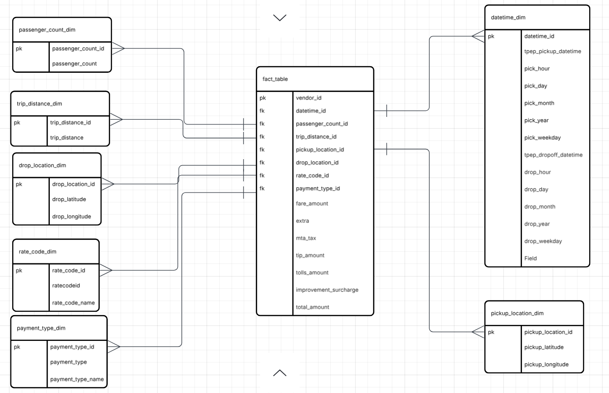

# Uber Data Analytics | Modern Data Engineering GCP Project

## Introduction
This project is about performing data analytics on Uber data using various tools and technologies, including GCP Storage, Python, Compute Instance, Mage Data Pipeline Tool, Google BigQuery and Looker Studio.

## Architecture

## Technology

1. Programming language : Python
2. Google Cloud Storage
3. Compute Instance
4. Mage AI - https://www.mage.ai/ 
5. Bigquery
6. Looker Studio

## DataSet

TLC Trip Record Data Yellow and green taxi trip records include fields capturing pick-up and drop-off dates/times, pick-up and drop-off locations, trip distances, itemized fares, rate types, payment types, and driver-reported passenger counts.

Link - https://github.com/prathimasvani/Uber-Data-Analytics-Project/blob/main/uber_data.csv

## Dimension Modelling

