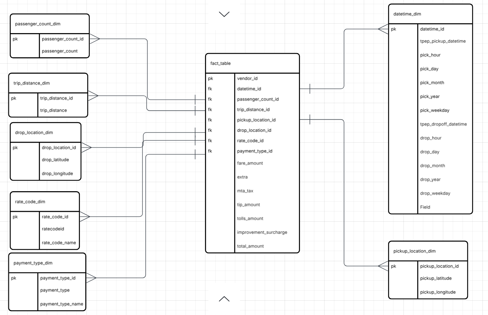

# Uber Data Analytics | Modern Data Engineering GCP Project

## Introduction
This project is about performing data analytics on Uber data using various tools and technologies, including GCP Storage, Python, Compute Instance, Mage Data Pipeline Tool, Google BigQuery and Looker Studio.

## Architecture

## Technology and Tools Used

1. Programming language : **Python** 
2. **Lucid Chart** - Designed fact and dimension tables

GCP
---
3. **Google Cloud Storage** - Data Storage
4. **Compute Instance** - To Host Mage AI
5.  **Mage AI** - https://www.mage.ai/ - ETL Pipeline - To extract, Transform and load into bigquery
6. **Bigquery** (DataWarehouse) - A part of GCP to create DataSet for analytics 
7. **Looker Studio** - A data visualization and analytics tool that enables users to build an interactive dashboard.

## DataSet

TLC Trip Record Data Yellow and green taxi trip records include fields capturing pick-up and drop-off dates/times, pick-up and drop-off locations, trip distances, itemized fares, rate types, payment types, and driver-reported passenger counts.

Link - https://github.com/prathimasvani/Uber-Data-Analytics-Project/blob/main/uber_data.csv

## Dimension Modelling

