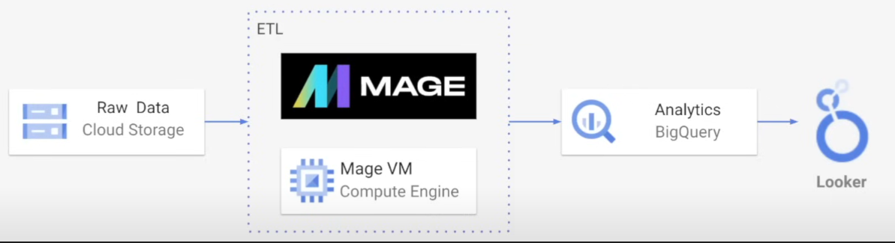
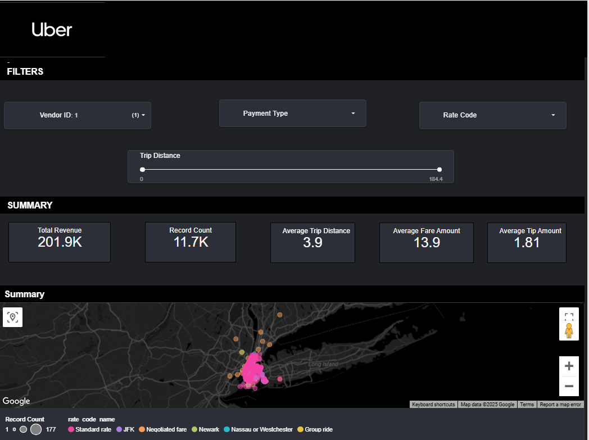

# Uber Data Analytics | Modern Data Engineering GCP Project

## Introduction
This project is about performing data analytics on Uber data using various tools and technologies, including GCP Storage, Python, Compute Instance, Mage Data Pipeline Tool, Google BigQuery and Looker Studio.

## Architecture

## Technology and Tools Used

1. Programming language : **Python** 
2. **Lucid Chart** - Designed fact and dimension tables

GCP
---
3. **Google Cloud Storage** - Data Storage
4. **Compute Instance** - To Host Mage AI
5.  **Mage AI** - https://www.mage.ai/ - ETL Pipeline - To extract, Transform and load into bigquery
6. **Bigquery** (DataWarehouse) - A part of GCP to create DataSet for analytics 
7. **Looker Studio** - A data visualization and analytics tool that enables users to build an interactive dashboard.

## DataSet

TLC Trip Record Data Yellow and green taxi trip records include fields capturing pick-up and drop-off dates/times, pick-up and drop-off locations, trip distances, itemized fares, rate types, payment types, and driver-reported passenger counts.

Link - https://github.com/prathimasvani/Uber-Data-Analytics-Project/blob/main/uber_data.csv

## Dimension Modelling

## Overview

1. Designed a Star schema (Fact and Dimension Table) using Lucid Chart
2. Stored Raw data in Google Cloud Storage.
3. Created Compute Engine VM on GCP to host Mage AI
4. Performed Extraction , Transformation and loading into BigQuery using Mage AI
    4.1 Extraction - From GCP URL --> Mage
    4.2 Transformation - Convert datetime fields, Drop duplicates, Creating fact and dimension Tables.
    4.3 Loading - Loaded Data into BigQuery
5. Created DataSet using required information for analytics in BigQuery   
6. Transformed data is visualized in Looker dashboards.

## Insights

The final dashboard, built using Looker Studio, provides interactive visual insights into Uber trip data.

1. Interactive filters help explore trips by vendor, payment type,rate code and distance.
2. Key performance indicators such as total revenue, average fare, average tip, and trip distance are summarized.
3. A geo map visualization displays pickup spots.

## Acknoweledgment

A big shoutout to Darshil for this tutorial and the amazing youtube content.
